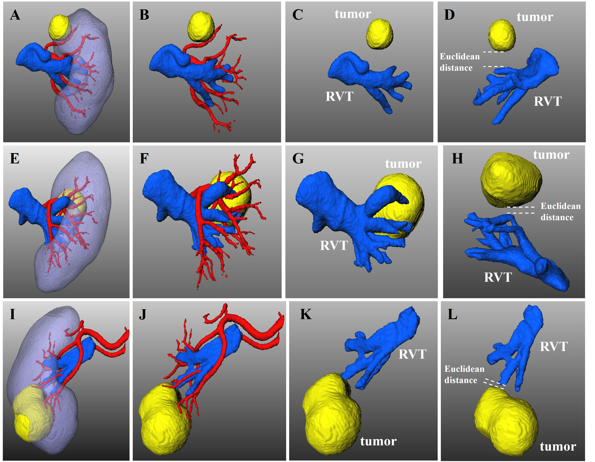

# Predictive role of tumor’s distance to renal venous system in the risk of selective renal artery clamping during partial nephrectomy

- **Purpose:** To develop a tridimensional integrated renal structure (TIRS) model by deep learning technique, to present the spatial relationship between tumors and the renal venous trunk (RVT), and to explore the risk factors of selective renal artery clamping (SRAC) failure during partial nephrectomy (PN) using the TIRS model.
- **Methods:** Based on the Meta Grayscale Adaptive (MGA) network, a deep learning algorithm, the TIRS model was developed to make SRAC strategies and collect tumor characteristics. We retrospectively analyzed 136 consecutive patients who underwent laparoscopic PN with SRAC. Notably, the TIRS models can measure the spatial Euclidean distance from tumors to the RVT. Logistic regression analysis was used to evaluate the risk factors for SRAC failure.
- **Results:** Laparoscopic PN was successfully performed in all patients, with nine converted from SRAC to Main Renal Artery Clamping (MRAC). Multivariate analysis revealed that distance from tumors to the RVT, tumor size, R.E.N.A.L score, and endophytic growth pattern were independent risk factors of SRAC failure. The higher rate of conversion to MRAC was accompanied by a shorter distance from tumors to the RVT (<1.0 cm) (p=0.005), larger tumor size (p=0.004), higher R.E.N.A.L score (p=0.001), and endophytic growth pattern (p=0.009). An integrated scoring system for predicting the failure risk of SRAC is urgently required in future studies.
- **Conclusion:** The TIRS model can display multiple renal structures, especially venous systems, the RVTs and the distance from tumors to the RVT. The proximity of tumors to the RVT may increase the risk of SRAC failure.

