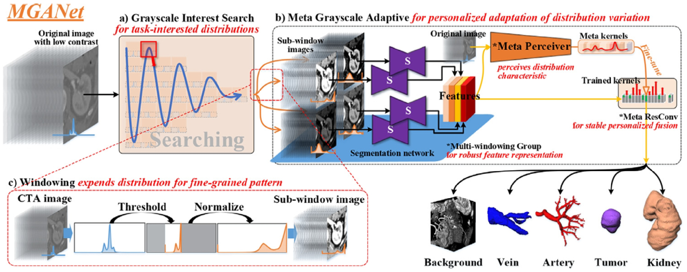

# Meta grayscale adaptive network for 3D integrated renal structures segmentation

[NOTE!!]**The code will be gradually opened when the technique paper and clinical paper be published**

[NOTE!] **Welcome to the challenge corresponding to this research - [KiPA22](https://kipa22.grand-challenge.org/)**

3D integrated renal structures (IRS) segmentation targets segmenting the kidneys, renal tumors, arteries, and veins in one inference. Clinicians will benefit from the 3D IRS visual model for accurate preoperative planning and intraoperative guidance of laparoscopic partial nephrectomy (LPN). However, no success has been reported in 3D IRS segmentation due to the inherent challenges in grayscale distribution and the networks representation preferences. Meta Greyscale Adaptive Network (MGANet) is the first deep learning framework to simultaneously segment the kidney, renal tumors, arteries and veins on CTA images in one inference.

<p align="center"></p>

## Paper
This repository provides the official PyTorch implementation of GEMINI in the following papers:

**Meta grayscale adaptive network for 3D integrated renal structures segmentation**<br/> 
[Yuting He](https://yutinghe-list.github.io/), Guanyu Yang, Jian Yang, Rongjun Ge, Youyong Kong, Xiaomei Zhu, Shaobo Zhang, Pengfei Shao, Huazhong Shu, Jean-Louis Dillenseger, Jean-Louis Coatrieux, [Shuo Li](http://www.digitalimaginggroup.ca/members/shuo.php)<br/>
Southeast University <br/>

## Citation
If you use this code for your research, please cite our papers:
```
@article{he2021meta,
  title={Meta grayscale adaptive network for 3D integrated renal structures segmentation},
  author={He, Yuting and Yang, Guanyu and Yang, Jian and Ge, Rongjun and Kong, Youyong and Zhu, Xiaomei and Zhang, Shaobo and Shao, Pengfei and Shu, Huazhong and Dillenseger, Jean-Louis and others},
  journal={Medical image analysis},
  volume={71},
  pages={102055},
  year={2021},
  publisher={Elsevier}
}
```

## Official implementation
- [PyTorch/](https://github.com/YutingHe-list/MGANet/pytorch)

## Acknowledgments
This research was supported by the National Natural Science Foundation under grants (31571001, 61828101, 31800825), Southeast University-Nanjing Medical University Cooperative Research Project (2242019K3DN08 ) and Excellence Project Funds of Southeast University. We thank the Big Data Computing Center of Southeast University for providing the facility support on the numerical calculations in this paper.
